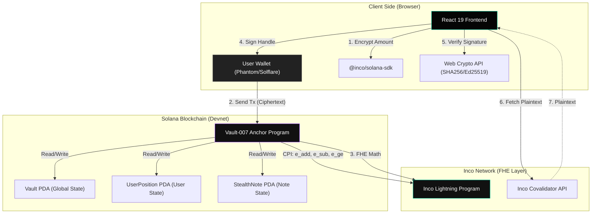

# Vault-007 Architecture Diagram

## Component Breakdown

### 1. Frontend (React 19)
- **VaultContext**: Manages global state, wallet connection, and FHE operations.
- **VaultService**: The bridge between the UI and the Solana/Inco protocols.
- **Components**: Terminal-style UI for Deposit, Withdraw, Transfer, and Stealth Notes.

### 2. Backend (Anchor/Rust)
- **Instructions**:
    - `deposit`: Moves SOL to escrow and adds encrypted amount to balance.
    - `withdraw`: Subtracts encrypted amount and releases SOL from escrow.
    - `transfer`: Private movement of funds between two user PDAs.
    - `claim_stealth_note`: Secret-based fund claiming with hidden recipient.
    - `apply_yield`: Global yield distribution via index update.
- **State**:
    - `Vault`: Stores total encrypted balance and global yield index.
    - `UserPosition`: Stores individual encrypted balance and last observed yield index.

### 3. FHE Layer (Inco Lightning)
- **Handles**: 128-bit references to ciphertexts stored on Inco.
- **CPI Operations**: Arithmetic performed by Inco validators without decrypting data.
- **Attestation**: Cryptographic proof that a user is authorized to decrypt a specific handle.
